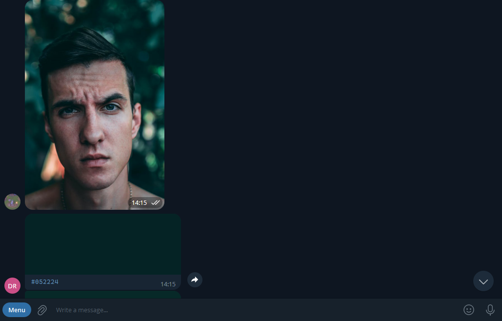

<br/>
<p align="center">
  <h3 align="center">PaletteBot</h3>

  <p align="center">
    A bot that creates a palette based on a photo
    <br/>
    <br/>
    <a href="https://github.com/NoLupiPls/PaletteBot"><strong>Explore the docs »</strong></a>
    <br/>
    <br/>
    <a href="https://github.com/NoLupiPls/PaletteBot">View Demo</a>
    .
    <a href="https://github.com/NoLupiPls/PaletteBot/issues">Report Bug</a>
    .
    <a href="https://github.com/NoLupiPls/PaletteBot/issues">Request Feature</a>
  </p>
</p>

     

## Table Of Contents

* [About the Project](#about-the-project)
* [Built With](#built-with)
* [Getting Started](#getting-started)
  * [Prerequisites](#prerequisites)
  * [Installation](#installation)
* [Usage](#usage)
* [Contributing](#contributing)
* [Authors](#authors)
* [Acknowledgements](#acknowledgements)

## About The Project



There are a lot of repositories on GitHub, but I didn't find a bot convenient for me. So I decided to make and improve the code for other programmers. Subsequently, this bot will be needed for artists who want to see the primary colors.

Of course, I will improve and support this bot. You can help me by writing to me and I will give you my banking details. You can also open a new branch and send a request under an error or an open question.

A list of commonly used resources that I find helpful are listed in the acknowledgements.

## Built With

* Aiogram
* Colorgram
* Pillow
* Python-dotenv

## Getting Started

This is an example of how you may give instructions on setting up your project locally.
To get a local copy up and running follow these simple example steps.

### Prerequisites

This is an example of how to list things you need to use the software and how to install them.

### Installation

1. Clone the repo

```sh
git clone https://github.com/NoLupiPls/PaletteBot.git
```

3. Install requirements

```sh
pip install -r requirements.txt
```

4. Create a file/change the values in .env

5. Start the project

```sh
python app.py
```

## Usage

* <b>/start</b> - start bot
* <b>/pallete</b> - view the palette
act

## Contributing

Contributions are what make the open source community such an amazing place to be learn, inspire, and create. Any contributions you make are **greatly appreciated**.
* If you have suggestions for adding or removing projects, feel free to [open an issue](https://github.com/NoLupiPls/PaletteBot/issues/new) to discuss it, or directly create a pull request after you edit the *README.md* file with necessary changes.
* Please make sure you check your spelling and grammar.
* Create individual PR for each suggestion.
* Please also read through the [Code Of Conduct](https://github.com/NoLupiPls/PaletteBot/blob/main/CODE_OF_CONDUCT.md) before posting your first idea as well.

### Creating A Pull Request

1. Fork the Project
2. Create your Feature Branch (`git checkout -b feature/AmazingFeature`)
3. Commit your Changes (`git commit -m 'Add some AmazingFeature'`)
4. Push to the Branch (`git push origin feature/AmazingFeature`)
5. Open a Pull Request

## Authors

* **NoLupiPls - Ilya** - *School student* - [NoLupiPls - Ilya](https://github.com/NoLupiPls/) - *Built this project*

## Acknowledgements

* [NoLupiPls - <i>Ilya</i>](https://github.com/NoLupiPls/)